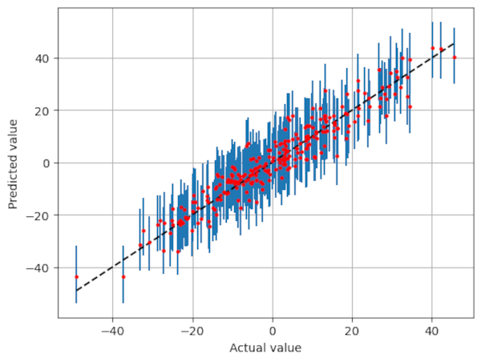

# Conformal Prediction

Examples of conformal prediction. Manual calculation, and using the MAPIE package.

## Run on Binder

## What is Conformal Prediction?

Conformal prediction is both a method of uncertainty quantification, and a method of classifying instances (which may be fine-tuned for subgroups).

Conformal prediction specifies a coverage, which specifies the probability that the true outcome is covered by the prediction region. The interpretation of prediction regions in conformal prediction depends on the task. For classification we get prediction sets, while for regression we get prediction intervals.

Below is an example of the difference between 'traditional' classification (balance of likelihood) and conformal prediction (sets).

  

Similarly, in regression, conformal prediction describes a coverage region around a point prediction. 

  

The advantages of this method are:

- **Guaranteed coverage**: Prediction regions generated by conformal prediction come with coverage guarantees of the true outcome. Bootstrapping, by comparison, often under-estimates uncertainty. Multi-class classification especially is often difficult to calibrate well. Conformal prediction does not depend on a well calibrated model, but calibration must be the same for new data as that use to build the conformal prediction model.
    - Coverage can be guaranteed across classes or subgroups.

- **Easy to use**: Conformal prediction approaches can be implemented from scratch with just a few lines of code. Tha MAPIE package makes it even easier.

- **Model-agnostic**: Conformal prediction works with any machine learning model.

- **Distribution-free**: Conformal prediction makes no distributional assumptions.

- **No retraining required**: Conformal prediction can be used without retraining the model.

- **Broad application**: conformal prediction works for classification, regression, time series forecasting, and many other tasks.

## Why should we care about uncertainty quantificiation?

Uncertainty quantification is essential in many situations:

- When we use model predictions to make decisions. How sure are we of those predictions?

- When we want to design robust systems that can handle unexpected situations (highlighting when the model has poor prediction certainty).

- When we have automated a task with machine learning and need an indicator of when to intervene (e.g. fraud detection - which people should be prioritised?).

- When we want to communicate the uncertainty associated with our predictions to stakeholders.

## What are the sources of uncertainty?

- The **model is trained on a random sample of data**, making the model itself a random variable. If you were to train the model on a different sample from the same distribution, you would get a slightly different model.

- Some **models are trained in a non-deterministic way**. Think of random weight initialization in neural networks or sampling mechanisms in random forests. If you train a model with non-deterministic training twice on the same data, you will get slightly different models.

- This uncertainty in model training is worse when the **training dataset is small**.

- **Hyperparameter tuning, model selection, and feature selection** have the same problem – all of these modeling steps involve estimation based on random samples of data, which adds to uncertainty to the modeling process.

- **The data may not be perfectly measured**. The features or the target may contain measurement errors, such as people filling out surveys incorrectly, copying errors, and faulty measurements.

- Data sets may have **missing values**.

## Alpha in conformal prediction - describes *coverage*

In comformal prediction we adjust alpha, which describes coverage (coverage = 1 - alpha):

- In regression coverage describes the interval that would include the real results.

- In classification coverage describes the proportion of sets that contain the true classification.

 - Specifically, if alpha is set to a certain value, the conformal prediction framework aims to ensure that the true outcome falls within the prediction set with a probability of at least 1 - alpha.
