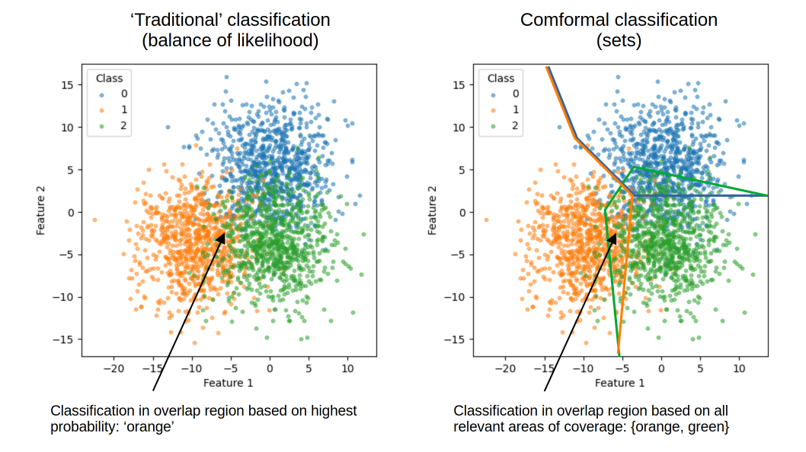

# Conformal Prediction for classification - from the ground up

This repository is based on Chris Molner's book - Introduction to Conformal Prediction with Python:

https://christophmolnar.com/books/conformal-prediction/

Chris is brilliant at making new machine learning techniques accessible to others. I'd especially also look at his books on Explainable Machine Learning.

## Run on Binder

You may run the notebooks on Binder. If it hasn't been used for a while it make take about 5 mins to initialise.

## What is Conformal Prediction?

Conformal prediction is both a method of uncertainty quantification, and a method of classifying instances (which may be fine-tuned for subgroups). At the same time it also identifiers outliers in the data!

Conformal prediction specifies a coverage, which specifies the probability that the true outcome is covered by the prediction region. The interpretation of prediction regions in conformal prediction depends on the task. For classification we get prediction sets, while for regression we get prediction intervals.

Below is an example of the difference between 'traditional' classification (balance of likelihood) and conformal prediction (sets).

  

The advantages of this method are:

- **Guaranteed coverage**: Prediction regions generated by conformal prediction come with coverage guarantees of the true outcome. Bootstrapping, by comparison, often under-estimates uncertainty. Multi-class classification especially is often difficult to calibrate well. Conformal prediction does not depend on a well calibrated model - the only thing that matters is that, like all machine learning, the new samples being classified must come from similar data distributions to the training and calibration data. Coverage can also be guaranteed across classes or subgroups, though this takes an extra step in the method which we will cover.
 
- **Easy to use**: Conformal prediction approaches can be implemented from scratch with just a few lines of code.

- **Model-agnostic**: Conformal prediction works with any machine learning model. It uses the normal outputs of whatever you preferred model is.

- **Distribution-free**: Conformal prediction makes no assumptions about underlying distributions of data; it is a non-parametric method.

- **No retraining required**: Conformal prediction can be used without retraining your model. It is another way of looking at, and using, model outputs.

- **Broad application**: conformal prediction works for tabular data classification, image or time-series classification, regression, and many other tasks, though we will demonstrate just classification here.

## Why should we care about uncertainty quantificiation?

Uncertainty quantification is essential in many situations:

- When we use model predictions to make decisions. How sure are we of those predictions?

- When we want to design robust systems that can handle unexpected situations - highlighting when the model has poor prediction certainty for a new instance that lies outside the region the model is robust for.

- When we want to communicate the uncertainty associated with our predictions to stakeholders.

## Alpha in conformal prediction - describes *coverage*

*Coverage* is key to conformal prediction. In classification it is the normal region of data that a particular class inhabits. Coverage is equivalent to *sensitivity* or *recall*; it is the proportion of observed values that are identified in the classification sets. We can tighten or loosen the area of coverage by adjusting $\alpha$ (coverage = 1 - $\alpha$.).